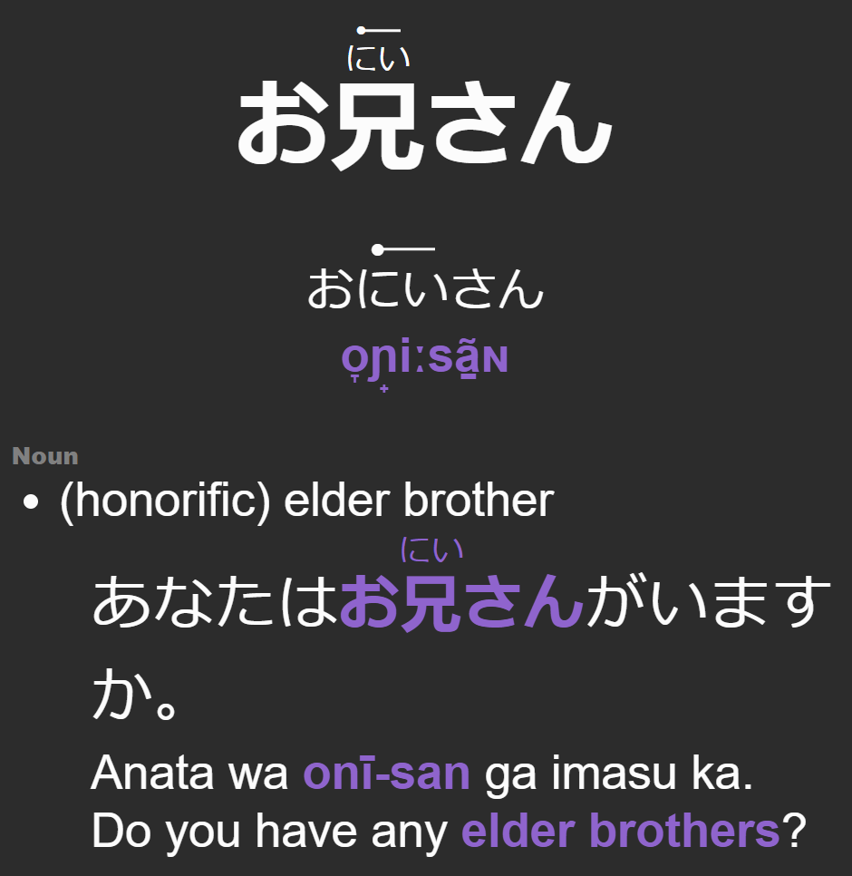
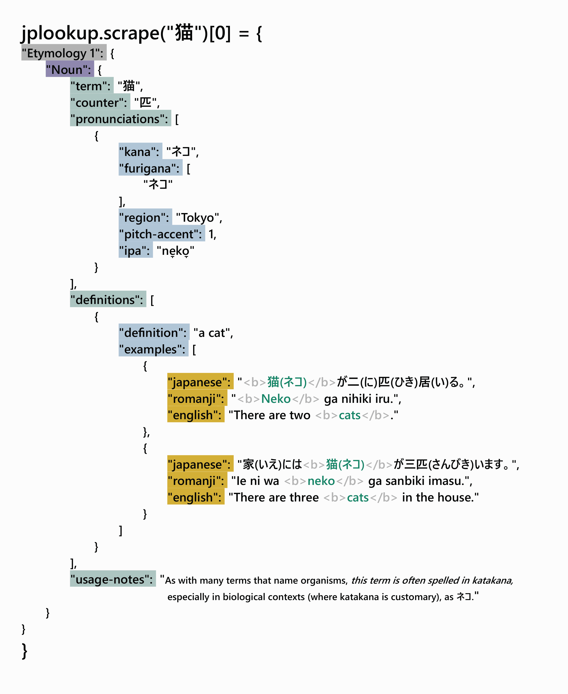

# jplookup
jplookup is a Python tool designed to scrape pitch accent, phonetic pronunciation, definitions and example sentences from Wiktionary and turn them into straight-forward flashcards for Anki.


# Features
## Pitch Accent
Anki cards made with jplookup can mark the pitch accent.
This will put a solid dot above the mora that will have a high pitch that's then followed by a mora with a low pitch.


<br>

When a noted high pitch is sustained due to being part of a diagraph and/or has a lengthening vowel, then CSS is used to render a line indicating this.


If there's no dot present, then the word follows the standard pitch accent.

<br>

## Scrapes Japanese word data
`jplookup.scrape("猫")` returns a list of dictionary objects.
The very first dictionary in the list contains the primary results:


The rest of the list may provide further dictionaries, which are gathered from page redirects whose contents could not be linked back to the primary results dictionary through mutual matching components.

<br>

jplookup seeks out parts of speech, under those there are pronunciations, definitions, synonyms and antonyms. Each pronunciation will generally have the kana, the IPA, the pitch accent, and the furigana. Each definition is a dictionary and can contain example sentences.

<br>

## Anki Integration 
The program outputs a text file that can easily be read into Anki.
Its fields are:
- Key Term
- Kana
- Kanji
- Definitions
- IPA
- Pretty Kana (HTML rendering)
- Pretty Kanji (HTML rendering)
- Usage Notes
- Counter Noun

<br>

## Handles Terms Linking to Other Pages
When Wiktionary links to a different page for an alternative spelling, then the information gathered from that redirect will be filtered through the original spelling in order to provide the only relevant information. 
- "撮る" redirects to the Wiktionary page for "とる" and grabs any definitions that are either specified as fitting with "撮る" or definitions with no context/kanji specification at all.
- "取る" redirects to the Wiktionary page for "とる" and grabs any definitions that are either specified as fitting with "取る" or definitions with no context/kanji specification at all.
- "とる" (the hiragana directly) goes to the Wiktionary page for "とる" and grabs all definitions regardless of context specification.

<br>

## Installation

```pip install jplookup```

<br>

You can also clone the repository and install the required dependencies (`bs4` and `jaconv`) as such:
```bash
git clone https://github.com/travisgk/jplookup.git
cd jplookup
pip install -r requirements.txt
```
